## 1. Prezentare Generală

Acest proiect demonstrează implementarea unui sistem e-commerce pentru motociclete folosind MongoDB, cu focus pe:
- Schema design strategies (Embedding, Referencing, Snapshot Pattern)
- Scaling solutions (Indexing, Replication, Sharding)
- CRUD operations cu Flask API
- Interfață web pentru interacțiune

### 🎬 Demo Video
[](https://youtu.be/l4DIea2bXlQ)

👉 [Vizualizează demo-ul aplicației](https://youtu.be/l4DIea2bXlQ)

---

## 2. Arhitectura Sistemului

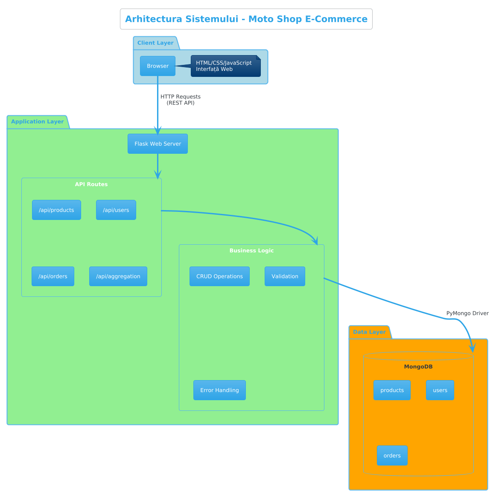

---

## 3. Data Model (Schema Design)

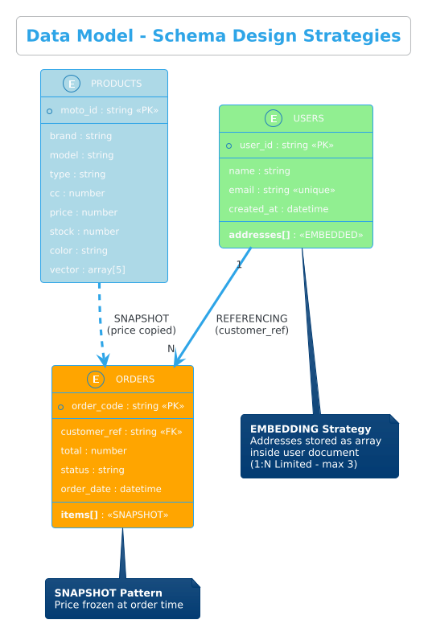

### 3.1 Entități și Relații

| Entitate | Descriere | Relații |
|----------|-----------|---------|
| **products** | Motociclete cu specificații | Independent |
| **users** | Utilizatori cu adrese multiple | 1:N limitat (addresses embedded) |
| **orders** | Comenzi plasate | N:1 cu users (referencing) |

### 3.2 Schema Design Strategies

#### Strategy 1: EMBEDDING (1:N Limitat)

**Utilizat pentru:** Adresele utilizatorilor

```javascript
// User Document cu Embedded Addresses
{
    "user_id": "U1",
    "name": "Ion Popescu",
    "email": "ion@email.ro",
    "addresses": [
        {
            "label": "Acasa",
            "city": "Bucuresti",
            "street": "Str. Libertatii 10",
            "zip": "010101"
        },
        {
            "label": "Birou",
            "city": "Cluj",
            "street": "Bd. Unirii 20",
            "zip": "400001"
        }
    ],
    "created_at": ISODate("2026-01-22T10:00:00Z")
}
```

| Pro | Contra |
|-----|--------|
| Un singur query pentru profil complet | Document size crește |
| Performanță excelentă la citire | Update pe tot documentul |
| Atomic updates | Limitat la ~16MB per document |

**Justificare:** Adresele sunt puține (2-3) și se modifică rar.

---

#### Strategy 2: REFERENCING (1:N Nelimitat)

**Utilizat pentru:** Comenzi → Utilizatori

```javascript
// Order Document cu Reference la User
{
    "order_code": "ORD-20260122-ABC123",
    "customer_ref": "U1",           // Reference la user_id
    "items": [
        {
            "moto_id": "MOTO-5",
            "product_name": "Yamaha Sport 1000R",  // Snapshot
            "price_snapshot": 15000,               // Snapshot
            "quantity": 1
        }
    ],
    "total": 15000,
    "status": "completed",
    "order_date": ISODate("2026-01-22T14:30:00Z")
}
```

| Pro | Contra |
|-----|--------|
| Fără duplicare date user | Necesită $lookup pentru JOIN |
| Scalează pentru milioane de comenzi | 2 queries pentru date complete |
| User update nu afectează comenzile | Complexitate crescută |

**Justificare:** Un user poate avea mii de comenzi - embedding ar depăși 16MB.

---

#### Strategy 3: SNAPSHOT PATTERN

**Utilizat pentru:** Prețuri și nume produse în comenzi

```javascript
// Snapshot la momentul comenzii
{
    "product_name": "Yamaha Sport 1000R",  // Copiat din products
    "price_snapshot": 15000,                // Prețul la momentul T
    // Chiar dacă prețul se schimbă ulterior,
    // comanda păstrează prețul original
}
```

| Pro | Contra |
|-----|--------|
| Integritate istorică | Duplicare date |
| Audit trail complet | Spațiu suplimentar |
| Facturi corecte | Sincronizare manuală dacă e nevoie |

**Justificare:** Prețurile se schimbă, dar facturile trebuie să rămână corecte.

---

### 3.3 Diagrama Relațiilor

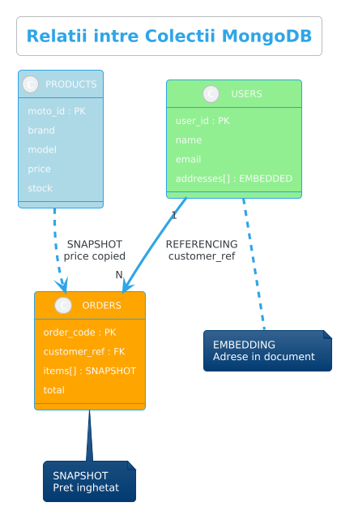

---

## 4. CRUD Operations

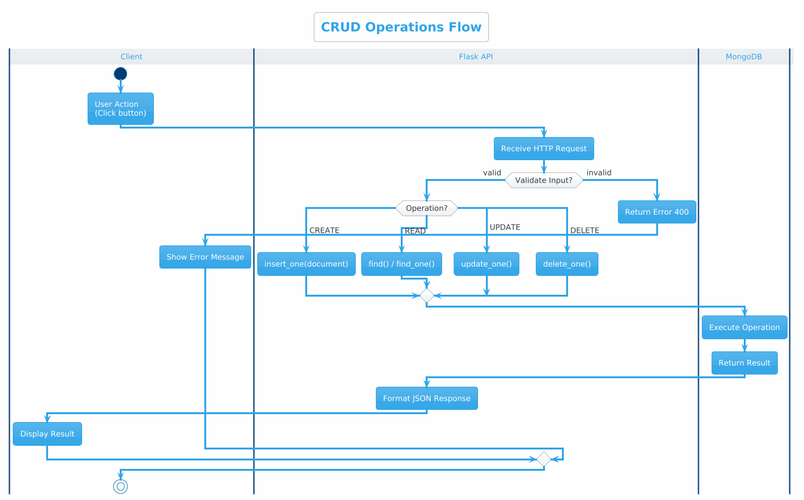

### 4.1 CREATE Operations

```python
# Creare utilizator nou
@app.route('/api/users', methods=['POST'])
def create_user():
    data = request.json
    new_user = {
        "user_id": generate_id(),
        "name": data['name'],
        "email": data['email'],
        "addresses": data.get('addresses', []),
        "created_at": datetime.now()
    }
    db.users.insert_one(new_user)
```

### 4.2 READ Operations

```python
# Citire produse cu filtrare
@app.route('/api/products')
def get_products():
    products = list(db.products.find({}, {'_id': 0}))
    return jsonify(products)
```

### 4.3 UPDATE Operations

```python
# Actualizare utilizator
@app.route('/api/users/<user_id>', methods=['PUT'])
def update_user(user_id):
    data = request.json
    db.users.update_one(
        {"user_id": user_id},
        {"$set": {
            "name": data['name'],
            "email": data['email'],
            "addresses": data['addresses']
        }}
    )
```

### 4.4 DELETE Operations

```python
# Ștergere utilizator
@app.route('/api/users/<user_id>', methods=['DELETE'])
def delete_user(user_id):
    db.users.delete_one({"user_id": user_id})
```

### 4.5 Aggregation Pipeline

```python
# Statistici pe brand
pipeline = [
    {"$group": {
        "_id": "$brand",
        "total_products": {"$sum": 1},
        "avg_price": {"$avg": "$price"},
        "total_stock": {"$sum": "$stock"}
    }},
    {"$sort": {"total_products": -1}},
    {"$project": {
        "_id": 1,
        "total_products": 1,
        "avg_price": {"$round": ["$avg_price", 0]},
        "total_stock": 1
    }}
]
results = db.products.aggregate(pipeline)
```

---

## 5. Scaling & Optimization Strategies

### 5.1 Indexing

#### Indexuri Create

```python
db.products.create_index("price")
db.products.create_index("brand")
db.products.create_index("moto_id", unique=True)
```

#### Performance Test Results

| Query | Fără Index | Cu Index | Îmbunătățire |
|-------|------------|----------|--------------|
| `find({price: {$gt: 10000}})` | ~15ms | ~2ms | **7.5x** |
| `find({brand: "Yamaha"})` | ~12ms | ~1ms | **12x** |
| `find({moto_id: "MOTO-500"})` | ~18ms | ~0.5ms | **36x** |

*Testat pe 1000 documente*

### 5.2 Replication (Replica Set)


**Setup Commands:**
```bash
mongod --replSet rs0 --port 27017 --dbpath /data/db1
mongod --replSet rs0 --port 27018 --dbpath /data/db2
mongod --replSet rs0 --port 27019 --dbpath /data/db3

# Inițializare
rs.initiate({
  _id: "rs0",
  members: [
    { _id: 0, host: "localhost:27017" },
    { _id: 1, host: "localhost:27018" },
    { _id: 2, host: "localhost:27019" }
  ]
})
```

**Failover Test:**
- Oprire PRIMARY → SECONDARY devine PRIMARY automat (~10 secunde)
- Aplicația se reconectează transparent

### 5.3 Sharding

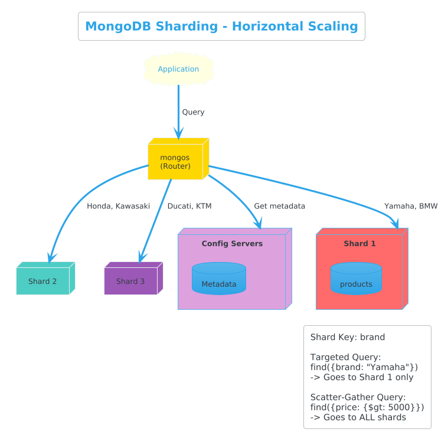

**Shard Key Selection:**

| Shard Key | Distribuție | Query Efficiency |
|-----------|-------------|------------------|
| `brand` (Range) | Poate fi dezechilibrată | Targeted pentru brand queries |
| `_id` (Hashed) | Uniformă | Scatter-gather pentru range |
| `{brand: 1, _id: 1}` | Echilibrată | Optim pentru majoritatea |

### 5.4 Vertical vs Horizontal Scaling

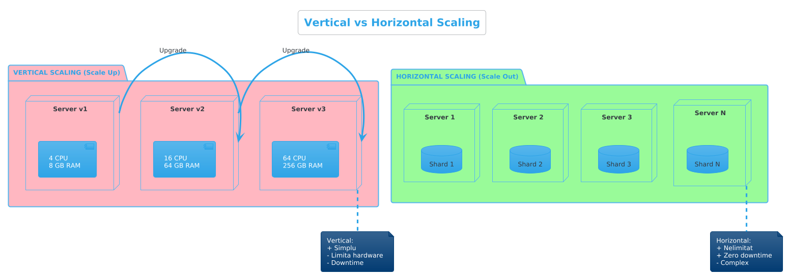

| Criteriu | Vertical Scaling | Horizontal Scaling |
|----------|------------------|-------------------|
| Ce faci | Adaugi RAM, CPU, SSD | Adaugi mai multe servere |
| Cost | Crește exponențial | Crește liniar |
| Limită | Hardware maxim | Practic nelimitată |
| Complexitate | Simplă | Necesită config |
| Downtime | Necesită restart | Zero downtime |
| Când folosești | Workloads mici-medii | Volume mari, HA |

---

## 6. Error Handling

### Validare Input

```python
# Validare email unic
existing = db.users.find_one({"email": email})
if existing:
    return jsonify({"error": "Email deja folosit!"}), 400

# Validare format email
if '@' not in email or '.' not in email.split('@')[-1]:
    return jsonify({"error": "Format email invalid!"}), 400

# Validare câmpuri obligatorii
if not data.get('name'):
    return jsonify({"error": "Numele este obligatoriu!"}), 400
```

### Common Pitfalls

| Pitfall | Problemă | Soluție |
|---------|----------|---------|
| Embedding prea mult | Document > 16MB | Folosește referencing |
| Lipsa indexuri | Full collection scan | Creează indexuri pe câmpuri filtrate |
| Indexuri excesive | Write-uri lente | Indexează doar ce e necesar |
| Shard key greșită | Hotspots | Alege key cu cardinality mare |
| ObjectId vs String | Comparații eșuate | Folosește consistent același tip |
| N+1 Query Problem | Performanță slabă | Folosește $lookup sau embedding |

---

## 7. MongoDB vs SQL

| Criteriu | MongoDB | SQL (PostgreSQL) |
|----------|---------|------------------|
| Schema | Flexibilă (schemaless) | Rigidă (predefinită) |
| Relații | Embedding + Referencing | Foreign Keys + JOINs |
| Scalare | Sharding nativ | Replicare, sharding complex |
| Queries | JSON-like | SQL standard |
| Transactions | Multi-document (v4.0+) | ACID complet |
| Use case | Documente variabile | Date structurate |

**De ce MongoDB pentru acest proiect:**
1. **Schema flexibilă:** Specs diferite per motocicletă
2. **Embedded documents:** Adrese naturale ca array
3. **Horizontal scaling:** Sharding nativ pentru creștere
4. **JSON native:** API responses directe
5. **Vector search:** Suport pentru AI/ML embeddings

---

## 8. Configurare Software

### Versiuni Utilizate

| Tool | Versiune |
|------|----------|
| Python | 3.11+ |
| Flask | 3.0.0 |
| PyMongo | 4.6.0 |
| MongoDB | 7.0 |
| NumPy | 1.26.0 |

### Instalare

```bash
# Creare virtual environment
python -m venv .venv
.venv\Scripts\activate

# Instalare dependențe
pip install flask pymongo numpy

# Pornire MongoDB (local)
mongod --dbpath /data/db

# Rulare aplicație
python app.py
```

### Docker (Opțional)

```yaml
# docker-compose.yaml
version: '3.8'
services:
  mongodb:
    image: mongo:7.0
    ports:
      - "27017:27017"
    volumes:
      - mongodb_data:/data/db

volumes:
  mongodb_data:
```

```bash
docker-compose up -d
```

---

## 9. Screenshots

### Interfața Web

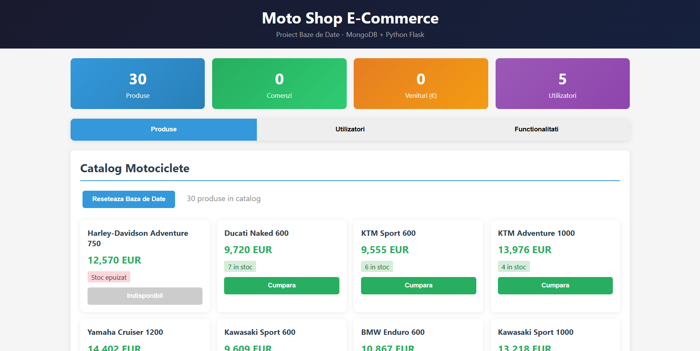

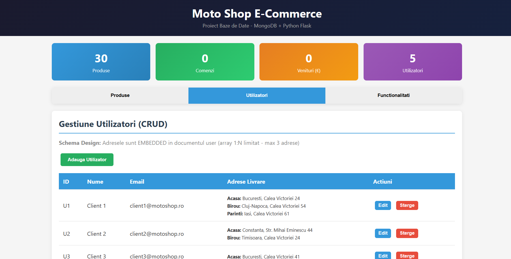

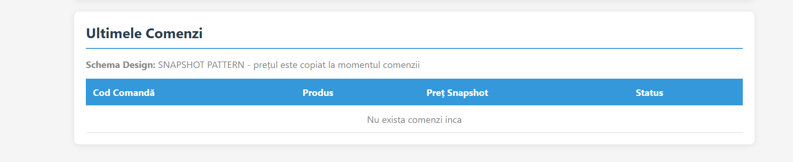

### Test Performance Indexing

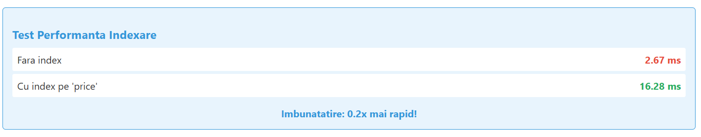

### Aggregation Pipeline Results

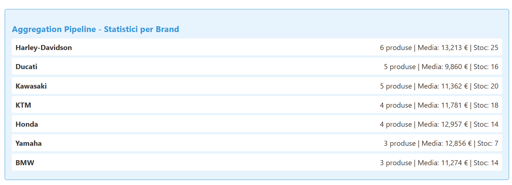

### MongoDB Compass

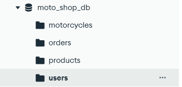

---

## 10. Anexe

### A. Structura Proiectului

```
Proiect_BD/
├── app.py                 # Aplicația principală Flask
├── docker-compose.yaml    # Configurare Docker
├── README.md              # Documentație (acest fișier)
├── prezentare.html        # Prezentare Remark.js
└── .venv/                 # Virtual environment Python
```

### B. API Endpoints

| Method | Endpoint | Descriere |
|--------|----------|-----------|
| GET | `/` | Interfața web |
| GET | `/api/products` | Lista produse |
| GET | `/api/users` | Lista utilizatori |
| POST | `/api/users` | Creare utilizator |
| PUT | `/api/users/<id>` | Update utilizator |
| DELETE | `/api/users/<id>` | Ștergere utilizator |
| POST | `/api/buy` | Plasare comandă |
| GET | `/api/orders` | Lista comenzi |
| GET | `/api/aggregation` | Statistici brand |
| GET | `/api/test-performance` | Test indexare |
| GET | `/api/vector-search` | Căutare semantică |
| GET | `/api/sharding-simulation` | Simulare sharding |

---


